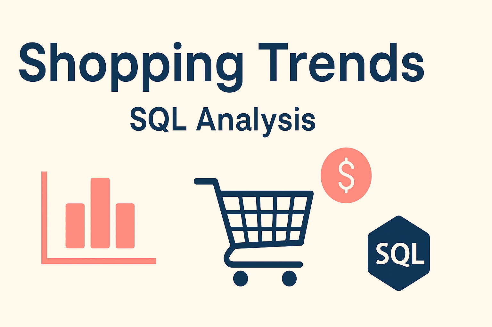

  

# Shopping Trends - SQL Analysis

This project explores customer shopping behavior through SQL-based analysis of a retail dataset. The dataset contains 3,900 records, capturing customer demographics, product details, payment methods, purchase habits, and more.

## 🧠 Business Problem

Retailers often struggle to understand which customers are driving revenue, which products perform best or worst, and how seasonality affects sales. Without clear insights, businesses risk overstocking, underselling, or misaligning their marketing strategies.

**Goal**: Leverage SQL to extract insights from the dataset and help businesses:
- Identify top spenders and target them with loyalty perks
- Optimize inventory based on product popularity and seasonality
- Reallocate marketing budgets by understanding review trends and preferences

## 🔍 Key Insights Explored

1. **Top Customers** – Who spends the most and where are they located?
2. **Product Trends** – Which products are most/least popular?
3. **Customer Feedback** – What are average review ratings by product category?
4. **Seasonality** – Which seasons bring the highest revenue?

## 🛠 Tools Used
- PostgreSQL / MySQL
- SQL (GROUP BY, JOINs, Aggregates)
- Excel (data cleaning)
- Power BI / Tableau (for visualizations)

---

Explore the `SQL_Queries.sql` file to see how each business question was answered.
